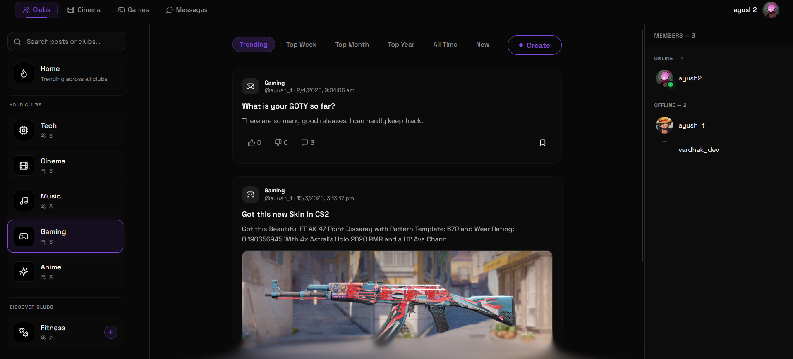
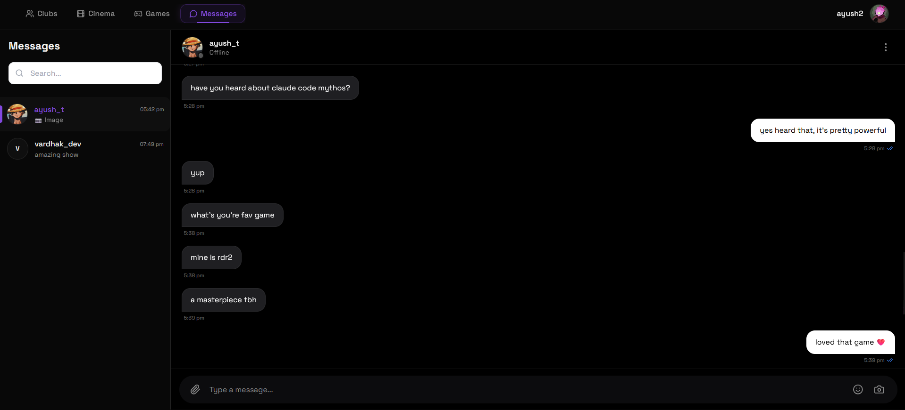
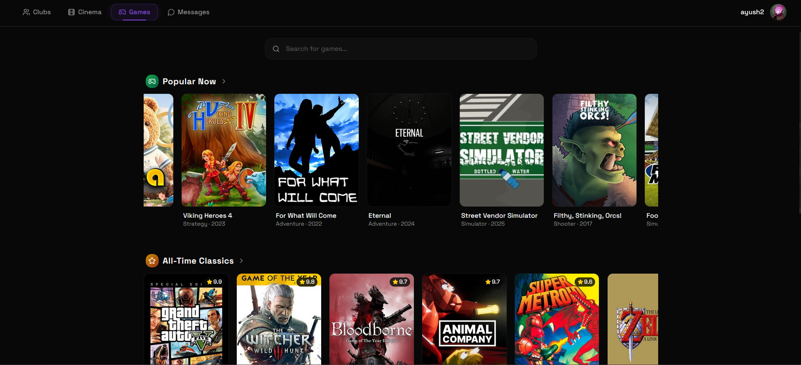
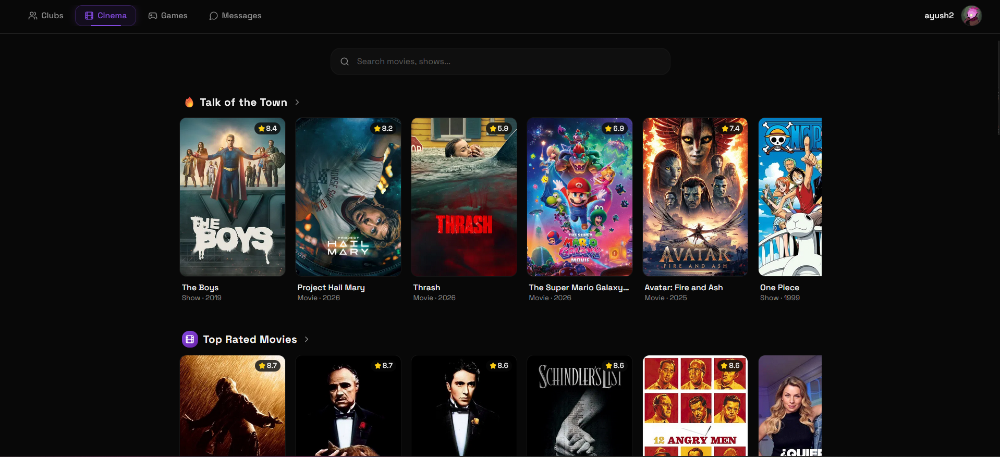
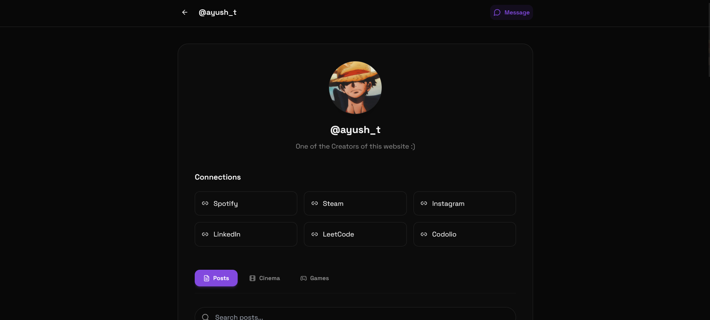
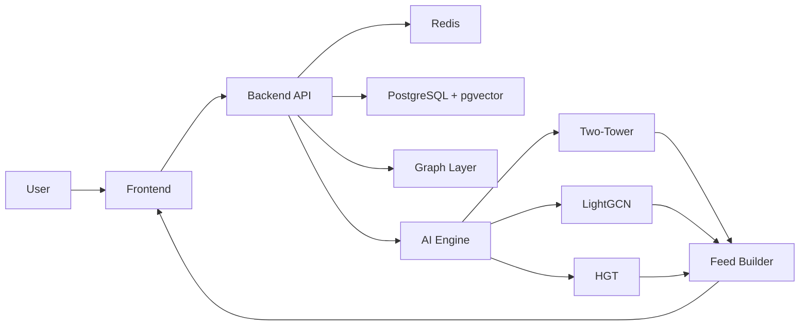
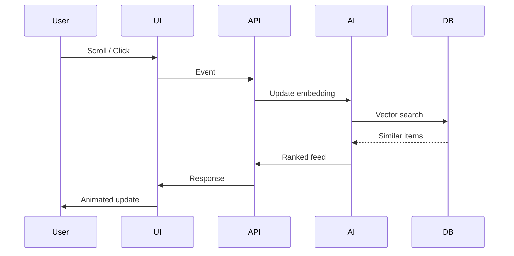

# TuneIn

<div align="center">

### A Social Feed That Thinks Beyond Your History

Not just what you like.
Not just what’s trending.
But what you’re about to discover.

<br/>


</div>

---

## 🎥 Product Preview

> Designed to feel alive. Built to think in real-time.

---

### 🧠 Feed / Community Layer

<p align="center">
  
</p>
<p align="center">
  <em>AI-powered feed with real-time engagement and community-driven discussions</em>
</p>

---

### 💬 Real-Time Messaging

<p align="center">
  
</p>
<p align="center">
  <em>Instant messaging with presence detection and live read receipts</em>
</p>

---

### 🎮 Games Discovery

<p align="center">
  
</p>
<p align="center">
  <em>Explore trending and all-time classic games with intelligent recommendations</em>
</p>

---

### 🎬 Cinema Discovery

<p align="center">
  
</p>
<p align="center">
  <em>Discover movies and shows with a visually rich, scrollable interface</em>
</p>

---

### 👤 Profile & Identity Layer

<p align="center">
  
</p>
<p align="center">
  <em>Unified identity connecting social presence, platforms, and interests</em>
</p>

---

## 🧠 The Idea

Most platforms optimize for **engagement**.
They trap users in loops of familiarity.

TuneIn solves:

> **Relevance vs Discovery**

By separating them into **two independent intelligence systems**, then blending them into a unified feed.

---

## ✨ Features

* **AI-Powered Feed** — neural + graph recommendation system
* **Dual Engine Ranking** — relevance + discovery balanced
* **Real-Time Messaging** — presence, read receipts, live sync
* **Vector Search** — semantic content understanding
* **Instant UI** — no refresh, no lag
* **Premium Motion** — fluid, intentional animations

---

## 🎨 Experience Layer

> Intelligence should not just work — it should *feel visible*

* Smooth micro-interactions
* Physics-based motion
* Real-time UI updates
* Zero-jank experience

**Powered by:**

* Magic UI
* shadcn/ui
* Framer Motion

---

## 🏗️ Architecture Overview



---

## 🧩 Core Systems

### 🔹 Recommendation Engine

**Two-Tower (Relevance)**

* Real-time session embeddings
* Instant similarity matching
* Cold-start resistant

**LightGCN (Discovery)**

* Graph-based relationships
* Multi-hop exploration
* Breaks echo chambers

**HGT (Unification)**

* Context-aware weighting
* Multi-relationship intelligence
* Unified embedding space

---

### 🔹 Feed System

* Candidate generation (dual engines)
* Ranking & blending
* Diversity + freshness control

> A continuously evolving feed, not a static list

---

### 🔹 Real-Time System

* WebSockets
* Redis-backed presence
* Read receipts
* Event-driven updates

---

### 🔹 Frontend Architecture

* Component-driven (shadcn/ui)
* Type-safe (TypeScript)
* Real-time sync handling
* Optimistic UI updates

---

## ⚡ What Happens When You Scroll



> This is not a refresh.
> It’s a real-time intelligence loop.

---

## ⚙️ Tech Stack

### Frontend

* React + TypeScript
* Tailwind CSS
* shadcn/ui
* Magic UI
* Framer Motion

### Backend

* FastAPI
* WebSockets
* Redis

### AI / ML

* PyTorch
* Two-Tower
* LightGCN
* HGT

### Infra

* PostgreSQL + pgvector
* Graph modeling
* Event-driven architecture

---

## 🔄 Data Flow

User → Interaction
→ Event Stream
→ Embedding Update
→ Vector Search
→ Graph Expansion
→ Ranking
→ Animated UI Update

---

## 📡 API Design

* REST → deterministic operations
* WebSockets → real-time updates

**Principles:**

* low latency
* strict typing
* event-driven

---

## 🧠 Why This Is Different

Most systems:

* Optimize for clicks
* Reinforce patterns

TuneIn:

* Models **intent + potential interest**
* Balances familiarity with discovery
* Treats interactions differently

> Not what you liked.
> What you’re ready to discover.

---

## 🛠️ Setup

```bash
git clone https://github.com/your-username/tunein
cd tunein
```

### Backend

```bash
cd apps/api
pip install -r requirements.txt
uvicorn main:app --reload
```

### Frontend

```bash
cd apps/web
npm install
npm run dev
```

---

## 📌 Future

* Edge inference
* Multimodal embeddings
* Adaptive ranking

---

## 🤝 Contributing

PRs welcome.

---

## 📄 License

MIT
